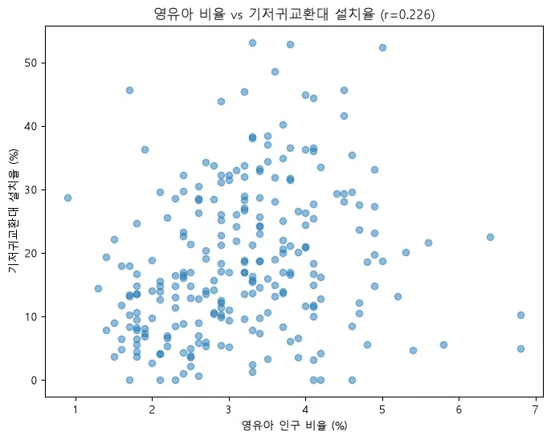

## 미니 프로젝트 1 보고서

#### 1. **분석 배경과 핵심 방향**     - 왜 이 주제인가, 무엇을 알고 싶었는가
    생활에 밀접한 주제를 분석하고 싶어 서치하던 중 해당 기사를 발견하고 결론에 주목하였다.
    '이 같은 차이(공공화장실 수)는 지역 특성에 따른 것으로 분석된다. 인구가 많은 도시는 상업시설이나 민간 건물 화장실 이용 비중이 높았다.' ([출처] 경기신문 (https://www.kgnews.co.kr/news/article.html?no=905844))
    인구수에 비례하지 않고 반비례할 것으로 예상하는 기사에 실제로 그러한지 확인하고자 분석 주제로 설정하였다.


#### 2. **데이터 소개** — 사용 데이터, 출처, 기준시점, 규모, 선정 이유
    1. 공중화장실정보 https://file.localdata.go.kr/file/public_restroom_info/info
    2026.06
    공중화장실정보 데이터는 국민의 위생상의 편의와 복지증진을 위해 공중이 이용하도록 국가, 지방자치단체, 법인 또는 개인이 설치하는 화장실에 대한 데이터로 화장실명, 소재지 주소 및 남녀·장애인·어린이용 위생시설 수, 개방시간 등 기본 이용 등의 데이터를 제공합니다.
    - 공공데이터 제공 표준 기준, 지자체에서 관리하는 공중화장실정보 화장실명, 주소, 개방시간 등을 제공
    - 기사에서 언급한 공공화장실의 위치 정보 등의 자료를 기본으로 분석할 수 있음
    2. 행정안전부_지역별(행정동) 성별 연령별 주민등록 인구수 https://www.data.go.kr/data/15097972/fileData.do
    2026.06.30
    행정동(읍면동)별 성별 연령별 주민등록 인구에 대한 데이터로, 행정동은 주민들이 거주하는 지역을 행정 능률과 주민 편의를 위하여 구분한 행정구역 단위를 말합니다.
    - 인구에 따른 분석을 진행해야하기 때문에 등록 인구 데이터를 선정하였음. 

#### 3. **가설** 
    — 3~5개, 각각 "무엇으로 어떻게 검증할 것인가"까지
    1. 등록인구 대비 화장실 밀도가 유독 낮은 지역은, 실제로는 오피스/상업지구·관광지일 가능성이 높을 것이다.
    2. 공중화장실 수뿐만 아니라 화장실 내부의 변기 공급량도 지역별로 차이가 있을 것이다.
    3. 고령 인구가 많을수록 장애인 대변기수의 비율이 높을 것이다.
    4. 영유아 인구가 많을수록 기저귀 교환대가 많을 것이다.

#### 4. **데이터 처리 과정** — 스키마 설계 근거, 전처리 판단(결측·이상치를 어떻게 왜 처리했는지), 
    (1) 스키마 설계 근거 
    a. 도로명 주소와 지번주소가 동일하게 나타나는 도/시+시/군/구 를 조인키로 활용하고자 하였다. 
    b. 조인 키 설계: 두 데이터의 조인키인 주소 중 '시,도' 와 '구' 단위의 문자열을 통합하여 사용하고자 하였다. (공공화장실 데이터 - 세부 주소, 인구현황 데이터) 
   
    
    (2)전처리 판단 : 
    a. tb_toilet
   
    - tb_toilet은 원본 CSV 자체의 입력 품질 문제와, 조인을 위해 필요한 지역 식별자(sido, sigungu)의 파싱 오류. 
    - 화장실 데이터는 주소가 자유 텍스트(도로명주소)로만 제공되어, 이걸 구조화된 sido/sigungu 컬럼으로 뽑아내는 과정에서 다양한 오류 발생
    - 화장실 개수가 지역당 10개 미만인 시군구는 HAVING COUNT(*) >= 10으로 분석에서 제외.(표본이 너무 작으면 극단값 발생)

    (구체적 예시)
    - 주소 파싱 실패: 시/구 정보 자체가 주소에 없음	=> dropna()로 해당 행 제외
    - 시/구 붙여쓰기: "전주시덕진구"처럼 공백 없이 표기 => 정규식으로 띄어쓰기 보정 후 재파싱
    - 도로명 오탐: "압구정로"→"압구", "금남구즉로"→"금남구" 잘못 인식 => 정규식 패턴 개선(온전한 단어 매칭)으로 대부분 방지, 잔여 건은 최종 결측 처리
    - 오탈자: "과쳔시"→과천시, "봉하군"→봉화군, "서을특별시"→서울특별시 등 =>	수동 매핑 딕셔너리로 치환
    - 행정구역 개편 반영 시점:	화장실 데이터(2026.05 갱신)가 2026.7.1 개편명(인천 신설구, 광주-전남 통합)을 이미 반영 
        -> population 기준(개편 이전 명칭)으로 역매핑. 인천은 읍면동 단위로 세분화하여 정확히 매핑
    - sido 축약 표기: "서울"→서울특별시, "경남"→경상남도 등	=> 수동 매핑으로 정식 명칭 통일
    - has_diaper_table (Y/N 텍스트)	분석에 쓸 수 없는 범주형 텍스트 =>	0/1 정수로 변환
    
    b. tb_population   
    - 원본이 읍면동 단위로 되어 있어 시군구 단위로 재집계(groupby)시 구조적 결측 발생.
    
    (구체적 예시)
    - 시군구명이 공백(' ')/NaN 혼재: 세종시는 구 단위 행정구역이 없어 원본에서 해당 컬럼이 비어있음, 일부는 공백 한 칸(' ')으로, 일부는 진짜 결측(NaN)으로 서로 다르게 입력. => str.strip()으로 공백을 표준 빈 문자열로 통일
    - groupby 시 NaN 키 자동 제외: pandas의 groupby()는 기본적으로 그룹 키가 NaN인 행을 결과에서 통째로 빼버림 → 세종시 일부 인구가 집계에서 누락될 위험 => groupby 실행 전에 fillna('')로 결측을 유효한 값으로 변환하여 누락 방지
    - 시군구별 인구 중복: 집계 과정 중 중복 행 가능성 => drop_duplicates(subset='sigungu')
    - 읍면동 단위 원본 → 시군구 단위 249개 지역으로 정상 집계 (세종특별자치시 포함 누락 없음)


#### 5. **분석 결과** — 가설별로 결과와 근거 수치 (SQL/코드 포함)

1. 
[가설] 인구 대비 공중화장실 수는 지역별로 차이가 있을 것이다.
[결과] 인구 대비 공중화장실 수는 지역별로 차이가 있다. (기사 인용과 같이, 인구밀도가 높을수록 공공 화장실의 비율이 낮았다.)

전국 평균: 219.925685483871
표준편차: 204.16802890724173
변동계수(CV): 0.93

=== 밀도 상위 5개 지역 ===
      sido sigungu  toilet_count  total_pop  seats_per_10k
0     충청북도     단양군           335      26628        1022.23
1    대구광역시     군위군           258      22622         977.81
2  강원특별자치도     화천군           150      22579         900.39
3     충청남도     금산군           366      48939         884.16
4  강원특별자치도     태백시           334      36811         880.17

=== 밀도 하위 5개 지역 ===
      sido    sigungu  toilet_count  total_pop  seats_per_10k
247   충청북도        진천군            22      85569           3.97
246   충청북도    청주시 서원구            41     187779          12.46
245  대구광역시         동구            64     338476          19.56
244   경상남도  창원시 마산회원구            48     174175          21.82
243  부산광역시        금정구            57     205672          22.95


[SQL]
```sql
SELECT
    t.sido,
    t.sigungu,
    COUNT(*) AS toilet_count,
    SUM(t.total_seats) AS total_seats,
    p.total_pop,
    ROUND(SUM(t.total_seats) * 10000.0 / p.total_pop, 2) AS seats_per_10k
FROM tb_toilet t
JOIN tb_population p ON t.sido = p.sido AND t.sigungu = p.sigungu
GROUP BY t.sido, t.sigungu, p.total_pop
ORDER BY seats_per_10k DESC;
```

[py]
```py

query_main = """
SELECT
    t.sido, t.sigungu,
    COUNT(*) AS toilet_count,
    SUM(t.total_seats) AS total_seats,
    p.total_pop,
    ROUND(SUM(t.total_seats) * 10000.0 / p.total_pop, 2) AS seats_per_10k
FROM tb_toilet t
JOIN tb_population p ON t.sido = p.sido AND t.sigungu = p.sigungu
GROUP BY t.sido, t.sigungu, p.total_pop
HAVING COUNT(*) >= 10
ORDER BY seats_per_10k DESC
"""

df_main = pd.read_sql(query_main, conn)

print("전국 평균:", df_main['seats_per_10k'].mean())
print("표준편차:", df_main['seats_per_10k'].std())
cv = df_main['seats_per_10k'].std() / df_main['seats_per_10k'].mean()
print(f"변동계수(CV): {cv:.2f}")

print(df_main.nlargest(5, 'seats_per_10k')[['sido','sigungu','toilet_count','total_pop','seats_per_10k']])
print(df_main.nsmallest(5, 'seats_per_10k')[['sido','sigungu','toilet_count','total_pop','seats_per_10k']])
```


2.

[가설] 
공중화장실 수뿐만 아니라 화장실 내부의 변기 공급량도 지역별로 차이가 있을 것이다.

[결과] 공중화장실 수뿐만 아니라 화장실 내부의 변기 공급량도 지역별로 차이가 있다.
화장실 1개당 평균 변기 수는 지역별로 1.55개에서 46.66개까지 약 30배 차이가 났으며(CV=0.45), 이는 지역 간 화장실 규모에 상당한 편차가 있다.
전국 평균: 12.49개/화장실
표준편차: 5.68
최댓값: 46.66 vs 최솟값: 1.55
변동계수(CV): 0.45
tier
평균 범위                205
상위 이상치(대형화장실 밀집)      30
하위 취약지역(소형화장실 위주)     13
Name: count, dtype: int64

=== 화장실 1개당 변기 수 상위 5개 지역 ===
      sido sigungu  toilet_count  total_seats  avg_seats_per_toilet
0    인천광역시     계양구           346      16143.0                 46.66
1      경기도     김포시           313      13808.0                 44.12
2      경기도     과천시            89       3380.0                 37.98
3  전북특별자치도     익산시           289       9499.0                 32.87
4  강원특별자치도     평창군           128       3310.0                 25.86

=== 화장실 1개당 변기 수 하위 5개 지역 ===
        sido  sigungu  toilet_count  total_seats  avg_seats_per_toilet
247     충청북도      진천군            22         34.0                  1.55
246  강원특별자치도      인제군            32        100.0                  3.13
245  전북특별자치도      순창군           127        618.0                  4.87
244     충청북도  청주시 서원구            41        234.0                  5.71
243     충청북도  청주시 상당구            78        471.0                  6.04

```sql
[SQL]
SELECT
    t.sido,
    t.sigungu,
    COUNT(*) AS toilet_count,
    SUM(t.total_seats) AS total_seats,
    ROUND(SUM(t.total_seats) * 1.0 / COUNT(*), 2) AS avg_seats_per_toilet
FROM tb_toilet t
GROUP BY t.sido, t.sigungu
HAVING COUNT(*) >= 10
ORDER BY avg_seats_per_toilet DESC;
```
[py]
```py
import pandas as pd
import numpy as np


# SQL 쿼리 결과 가져오기

query_seats = """
SELECT
    t.sido, t.sigungu,
    COUNT(*) AS toilet_count,
    SUM(t.total_seats) AS total_seats,
    ROUND(SUM(t.total_seats) * 1.0 / COUNT(*), 2) AS avg_seats_per_toilet
FROM tb_toilet t
GROUP BY t.sido, t.sigungu
HAVING COUNT(*) >= 10
ORDER BY avg_seats_per_toilet DESC
"""

df_seats = pd.read_sql(query_seats, conn)
print(df_seats.shape)
df_seats.head()


# 정규화 지표 및 분포 확인 (변동계수 CV)

mean_val = df_seats['avg_seats_per_toilet'].mean()
std_val = df_seats['avg_seats_per_toilet'].std()
cv = std_val / mean_val

print(f"전국 평균: {mean_val:.2f}개/화장실")
print(f"표준편차: {std_val:.2f}")
print(f"최댓값: {df_seats['avg_seats_per_toilet'].max()} vs 최솟값: {df_seats['avg_seats_per_toilet'].min()}")
print(f"변동계수(CV): {cv:.2f}")


# z-score 표준화 + np.where로 이상치 분류

df_seats['seats_z'] = (df_seats['avg_seats_per_toilet'] - mean_val) / std_val

df_seats['tier'] = np.where(
    df_seats['seats_z'] >= 1, '상위 이상치(대형화장실 밀집)',
    np.where(df_seats['seats_z'] <= -1, '하위 취약지역(소형화장실 위주)', '평균 범위')
)

print(df_seats['tier'].value_counts())


# 상/하위 지역 확인

print("\n=== 화장실 1개당 변기 수 상위 5개 지역 ===")
print(df_seats.nlargest(5, 'avg_seats_per_toilet')[['sido','sigungu','toilet_count','total_seats','avg_seats_per_toilet']])

print("\n=== 화장실 1개당 변기 수 하위 5개 지역 ===")
print(df_seats.nsmallest(5, 'avg_seats_per_toilet')[['sido','sigungu','toilet_count','total_seats','avg_seats_per_toilet']])


```


3. 
[가설] 고령 인구가 많을수록 장애인 대변기수의 비율이 높을 것이다.

[결과] 고령 인구가 많을수록 장애인 대변기수의 비율은 비례하지 않았다.

    +------------------------+--------------+------------------------+
    | elderly_group          | region_count | avg_disabled_ratio_pct |
    +------------------------+--------------+------------------------+
    | 고령인구 비율 20% 미만    |           64 |                  13.68 |
    | 고령인구 비율 20% 이상    |          184 |                  12.42 |
    +------------------------+--------------+------------------------+
    상관계수: -0.123 (관계없음)

**SQL/CODE**


[SQL]

``` sql 
SELECT

    t.sido,
    t.sigungu,
    COUNT(*) AS toilet_count,
    SUM(t.disabled_seats) AS disabled_seats,
    ROUND(p.elderly_pop * 100.0 / p.total_pop, 1) AS elderly_ratio_pct,
    ROUND(SUM(t.disabled_seats) * 10000.0 / p.total_pop, 2) AS disabled_seats_per_10k
FROM tb_toilet t
JOIN tb_population p ON t.sido = p.sido AND t.sigungu = p.sigungu
GROUP BY t.sido, t.sigungu, p.elderly_pop, p.total_pop
HAVING COUNT(*) >= 10
ORDER BY elderly_ratio_pct DESC;
```

[py] 상관계수 수하기
```py
#3번 상관계수 계산
query_disabled = """
SELECT
    t.sido, t.sigungu,
    COUNT(*) AS toilet_count,
    ROUND(SUM(t.disabled_seats) * 100.0 / SUM(t.total_seats), 2) AS disabled_seats_ratio_pct,
    ROUND(p.elderly_pop * 100.0 / p.total_pop, 1) AS elderly_ratio_pct
FROM tb_toilet t
JOIN tb_population p ON t.sido = p.sido AND t.sigungu = p.sigungu
GROUP BY t.sido, t.sigungu, p.elderly_pop, p.total_pop
HAVING COUNT(*) >= 10
ORDER BY elderly_ratio_pct DESC
"""

df_disabled = pd.read_sql(query_disabled, conn)
print(df_disabled.shape)
df_disabled.head()

# 상관계수 계산
corr = df_disabled['elderly_ratio_pct'].corr(df_disabled['disabled_seats_ratio_pct'])
print(f"고령인구 비율 vs 장애인용 변기 비율 상관계수: {corr:.3f}")

# z-score, tier - 표준화 및 이상치 판별
df_disabled['ratio_z'] = (
    (df_disabled['disabled_seats_ratio_pct'] - df_disabled['disabled_seats_ratio_pct'].mean())
    / df_disabled['disabled_seats_ratio_pct'].std()
)

df_disabled['tier'] = np.where(
    df_disabled['ratio_z'] >= 1, '상위 이상치',
    np.where(df_disabled['ratio_z'] <= -1, '하위 취약지역', '평균 범위')
)
# 고령인구 비율 상위 10곳- 장애인용 변기 비율과 z-score, tier 출력 
print(df_disabled.sort_values('elderly_ratio_pct', ascending=False).head(10))
```

4. 
[가설] 영유아 인구가 많을수록 기저귀 교환대가 많을 것이다.

[결과] 영유아 인구와 기저귀 교환대 수는 양의 상관계수를 가지나 (0.2) 선명하게 관계가 있음을 나타내지는 않는다. (약한 양의 상관관계)

+-----------------------+--------------+-----------------+
| child_group           | region_count | avg_diaper_rate |
+-----------------------+--------------+-----------------+
| 유아인구 비율 5% 미만    |          239 |           18.72 |
| 유아인구 비율 5% 이상    |            9 |           13.50 |
+-----------------------+--------------+-----------------+


--영유아 비율은 높은데 기저귀 교환대 적은 곳 
    sido  sigungu  child_ratio_pct  diaper_rate_pct
0    경기도  화성시 동탄구              6.8              5.0
1  부산광역시      강서구              6.8             10.2
3    경기도  화성시 효행구              5.8              5.6
5    경기도  화성시 병점구              5.4              4.7
7   충청북도  청주시 흥덕구              5.2             13.2
8  대전광역시      유성구              5.0             18.7


[SQL]
```sql
SELECT
    t.sido,
    t.sigungu,
    COUNT(*) AS toilet_count,
    ROUND(AVG(t.has_diaper_table) * 100, 1) AS diaper_rate_pct,
    ROUND(p.child_pop * 100.0 / p.total_pop, 1) AS child_ratio_pct
FROM tb_toilet t
JOIN tb_population p ON t.sido = p.sido AND t.sigungu = p.sigungu
GROUP BY t.sido, t.sigungu, p.child_pop, p.total_pop
HAVING COUNT(*) >= 10
ORDER BY child_ratio_pct DESC;
```
[py] 상관계수 구하기 
```py
query_diaper = """
SELECT
    t.sido, t.sigungu,
    COUNT(*) AS toilet_count,
    ROUND(AVG(t.has_diaper_table) * 100, 1) AS diaper_rate_pct,
    ROUND(p.child_pop * 100.0 / p.total_pop, 1) AS child_ratio_pct
FROM tb_toilet t
JOIN tb_population p ON t.sido = p.sido AND t.sigungu = p.sigungu
GROUP BY t.sido, t.sigungu, p.child_pop, p.total_pop
HAVING COUNT(*) >= 10
ORDER BY child_ratio_pct DESC
"""

df_diaper = pd.read_sql(query_diaper, conn)
print(df_diaper.shape)
df_diaper.head()
corr = df_diaper['child_ratio_pct'].corr(df_diaper['diaper_rate_pct'])
print(f"영유아 비율 vs 기저귀교환대 설치율 상관계수: {corr:.3f}")
```


#### 6. **해석과 인사이트** — 본인의 언어로. 예상과 달랐던 부분 포함

가설 1. 인구 대비 공중화장실 수는 지역별로 차이가 있다. (기사 인용과 같이, 인구밀도가 높을수록 공공 화장실의 비율이 낮았다.)

인구 적은 군 지역(단양·군위·화천)이 밀도 최상위, 대도시 구(대구 동구·부산 금정구 등)가 최하위임으로 나타났다. 
가설을 세울 당시 참고했던 기사의 인용과 일치함을 확인하였다. 해당 분석의 결과로는 기사에서 언급된 인구가 많은 민간/상업 화장실 사용, 면적 넓은 군 지역의 최소 배치 필요성, 대도시 인프라 확충 지연이 원인으로 추정된다. 


가설 2. 공중화장실 수뿐만 아니라 화장실 내부의 변기 공급량도 지역별로 차이가 있다.
화장실 1개당 평균 변기 수는 지역별로 1.55개에서 46.66개까지 약 30배 차이가 났으며(CV=0.45), 이는 지역 간 화장실 규모에 상당한 편차가 있음을 보여준다. 특히 인구 대비 화장실 밀도(가설 1)와의 상관계수가 -0.037로 사실상 무관하게 나타나, 공공 화장실의 수와 규모는 서로 독립적인 지역 특성임을 확인하였다. 

가설 3. 고령 인구가 많을수록 장애인 대변기수의 비율은 비례하지 않았다.
고령인구가 많을수록 장애인의 대변기수가 증가할 것으로 예상하였으나, 비례하지 않았다. 이는 공공화장실의 건립이 제시된 건축 법적규정을 따라 구조가 지정될 뿐, 필요에 의해서 변화하지 않는 것으로 해석할 수 있다. 

가설 4. 영유아 인구와 기저귀 교환대 수는 양의 상관계수를 가지나 (0.2) 선명하게 관계가 있음을 나타내지는 않는다. 
가설 3과 마찬가지로 영유아가 많을수록 기저귀 교환대 수가 증가할 것으로 예상하였으나, 비례하지 않았다. 이는 공공화장실의 건립이 제시된 건축 법적규정을 따라 구조가 지정될 뿐, 필요에 의해서 변화하지 않는 것으로 해석할 수 있다. 또한 설치 시기 등 인구수 이외의 다각적인 변수에 의해 영향을 받을 것으로 예상한다. 


#### 7. **한계와 다음 단계** — 데이터의 한계, 검증 못 한 것, 더 하고 싶은 것
    
    - 공공화장실에만 국한되어 해당 지역의 인프라나 접근성등을 고려할 수 없었다.
    - 처음에는 유동인구도 공공화장실 설립에 영향을 끼치는 변수로 고려하여 추가하려고 했으나, 시계열 데이터의 분석이 너무 복잡해짐에 따라 폐기하고 등록인구 기준으로 분석하였다. 
    - 공공 데이터인만큼 양식이 통일되어있긴 했으나 수기로 작성된 문자열인만큼 깔끔하게 전처리하기가 어려웠고, 수동으로 자잘한 오타 등을 해결하는데 많은 시간이 소요되었다. 
    - 전처리 데이터 누락시 비슷한 영역의 데이터가 편향적으로 필터링되어 표본수에 의거한 분석시 결과에 영향을 주었다. 
    - 전처리로 적어진 데이터가 분모의 변수로 들어갈 경우 비율등의 값에 이상치가 발생하므로 이를 억제하기 위하여 특정 상수값 이상의 표본을 가진 데이터만 분석하도록 제한하였다. 
    - 유동인구등 보다 복합적으로 해당 공간을 나타낼 수 있는 정보들을 취합할 경우 더욱 정교한 분석이 가능할 것으로 보인다. 

#### 8. **(선택) 심화 확장 결과** — 시각화 / 쿼리 최적화 
    (x)

#### 9. **AI 활용 기록**
- cvs의 문자열 전처리 과정 중 주소의 시+군 normalize 과정 
- 데이터의 칼럼을 보고 분석 여부가 있는 추가 가설 조사
- 전처리와 과정에서 처리되지 않은 오류 (오타, 누락)을 알맞게 슬라이싱 
- 가설의 분석방향과 일치하는 sql, py 코드 작성
- 상관계수에 따른 결과의 의미 해석 
- 이상치 등 예외 사항 원인 분석 
